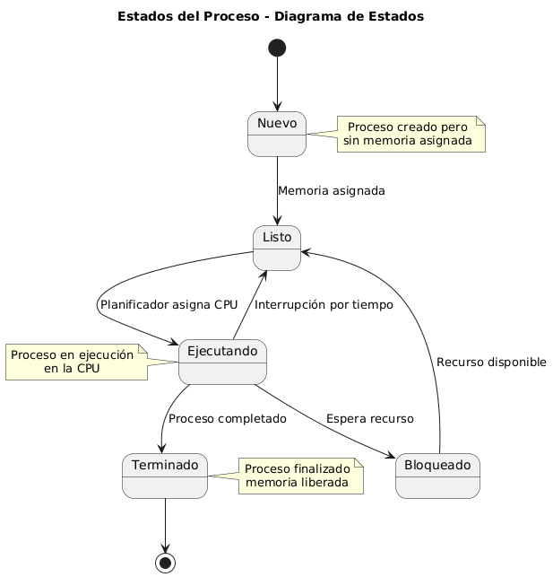
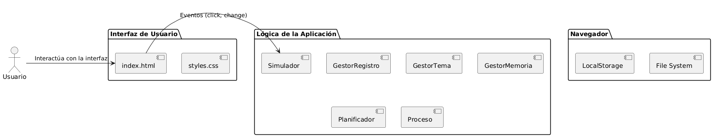
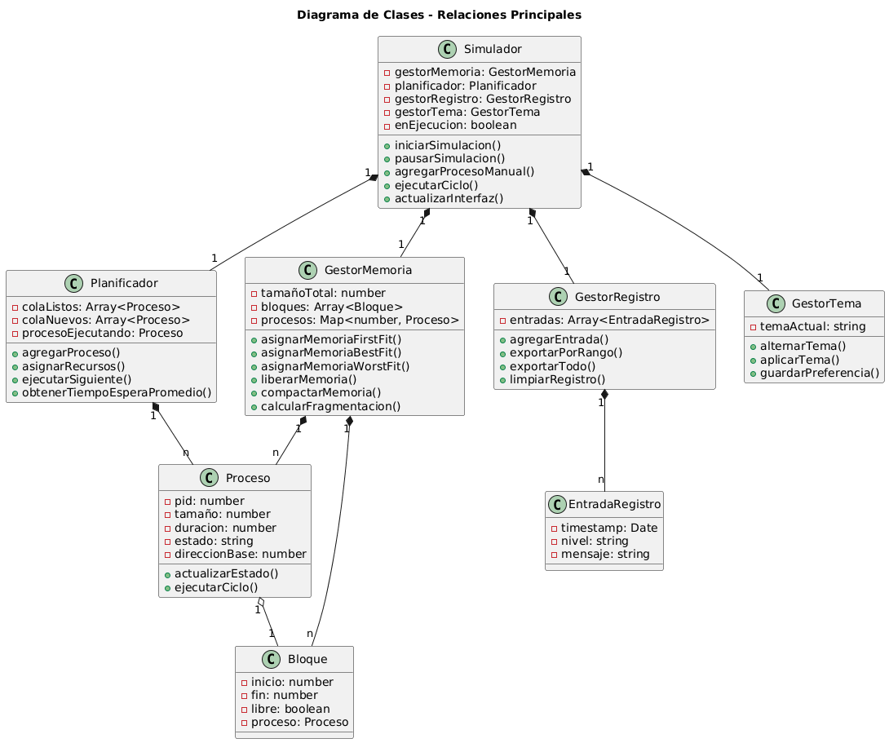
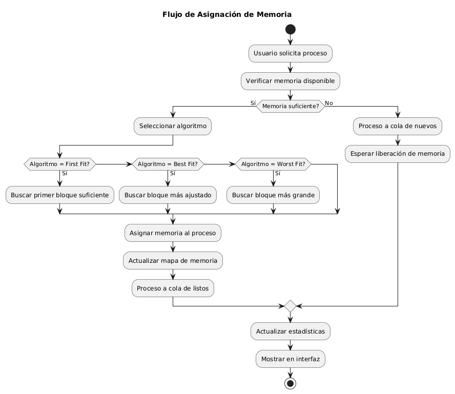
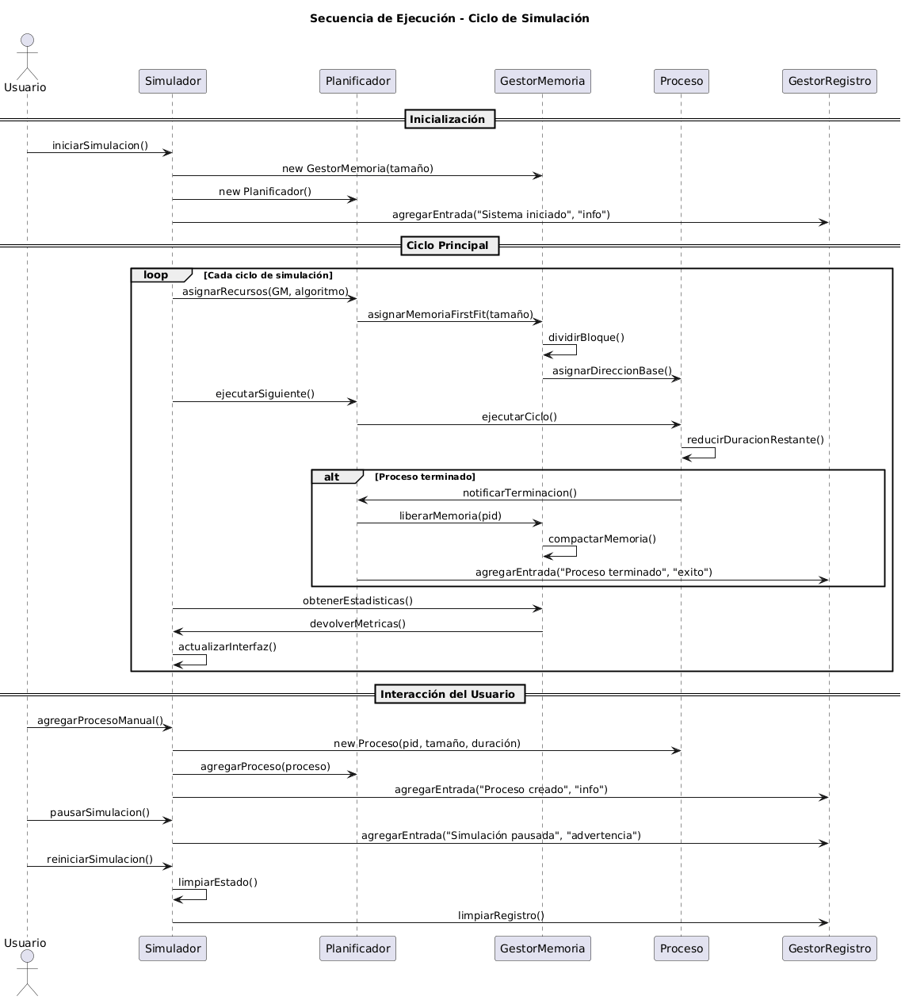

# Simulador de Gestión de Memoria y Procesos



## 📋 Descripción

Simulador educativo desarrollado para la materia de Sistemas Operativos que permite visualizar y experimentar con diferentes algoritmos de gestión de memoria y procesos. El sistema simula el comportamiento de un sistema operativo real gestionando la asignación de memoria, planificación de procesos y cálculo de métricas de desempeño.

## 🚀 Características Principales

- **Múltiples Algoritmos de Asignación**: First Fit, Best Fit y Worst Fit
- **Gestión de Procesos**: Estados completos (Nuevo, Listo, Ejecutando, Bloqueado, Terminado)
- **Visualización en Tiempo Real**: Mapa de memoria y tabla de procesos
- **Métricas de Desempeño**: Tiempo de espera, uso de memoria, fragmentación
- **Modo Claro/Oscuro**: Interfaz adaptable a preferencias del usuario
- **Registro de Actividades**: Exportación de logs con filtros por tiempo

## 🏗️ Arquitectura del Sistema



### Estructura de Archivos

```
proyecto/
├── img/
│   ├── diagrama_de_clases.png
│   ├── diagrama_de_estado.png
│   ├── diagrama_de_flujo.png
│   ├── diagrama_de_paquete.png
│   └── diagrama_de_secuencia.png
├── public/
│   ├── css/
│   │   └── styles.css
│   ├── icon/
│   │   └── favicon.ico
│   └── js/
│       ├── gestor-memoria.js
│       ├── gestor-registro.js
│       ├── gestor-tema.js
│       ├── main.js
│       ├── planificador.js
│       ├── proceso.js
│       └── simulador.js
├── index.html
└── README.md
```

### Diagrama de Clases



## 🎯 Guía de Uso Rápida

### 1. Configuración Inicial

1. **Abrir el simulador**: Abrir `index.html` en cualquier navegador moderno
2. **Configurar memoria**: Establecer el tamaño total de memoria (256KB - 8192KB)
3. **Seleccionar algoritmo**: Elegir entre First Fit, Best Fit o Worst Fit
4. **Iniciar sistema**: Click en "Iniciar Sistema"

### 2. Gestión de Procesos

#### Procesos Manuales
1. **Especificar proceso**:
   - Tamaño: 16KB - 512KB
   - Duración: 1-20 ciclos
   - Prioridad: Baja, Media, Alta
2. **Agregar proceso**: Click en "Agregar Proceso"

#### Procesos Automáticos
1. **Activar generación**: Click en "Generar Procesos Automáticos"
2. **Configurar frecuencia**: Establecer intervalo en segundos
3. **Los procesos se generarán automáticamente** con parámetros aleatorios

### 3. Monitoreo y Métricas

#### Panel de Memoria
- **Visualización gráfica** de bloques de memoria
- **Estadísticas en tiempo real**: Total, Libre, Usada, Fragmentación
- **Leyenda de colores**: Libre (Verde), Ocupado (Azul), Fragmentación (Amarillo)

#### Panel de Procesos
- **Tabla completa** con todos los procesos activos
- **Estados visuales** con colores diferenciados
- **Acciones rápidas**: Terminar proceso manualmente

#### Métricas de Desempeño
- **Tiempo de espera promedio**: Eficiencia del planificador
- **Uso de memoria**: Porcentaje de utilización
- **Procesos completados**: Throughput del sistema
- **Tasa de fragmentación**: Eficiencia de la asignación

## 🔧 Funcionalidades Avanzadas

### Modo de Gestión de Memoria
- **Paginación**: División en páginas de tamaño fijo
- **Compactación**: Reorganización para reducir fragmentación
- **Segmentación**: División por segmentos lógicos

### Exportación de Datos


#### Exportar Log Completo
1. Click en "Exportar Todo"
2. Se descargará archivo `log-completo.txt`

#### Exportar por Rango de Tiempo
1. Seleccionar "Desde" y "Hasta"
2. Validación automática de rangos
3. Click en "Exportar Rango"
4. Archivo con formato `log-rango-HH-MM-SS-a-HH-MM-SS.txt`

### Personalización de Interfaz
- **Cambio de tema**: Botón "Modo Oscuro/Claro"
- **Velocidad de simulación**: Control deslizante (1-10)
- **Preferencias guardadas** automáticamente

## 📊 Algoritmos Implementados

### First Fit
- **Estrategia**: Primer bloque suficiente encontrado
- **Ventaja**: Rápida ejecución
- **Desventaja**: Fragmentación externa al inicio

### Best Fit
- **Estrategia**: Bloque más ajustado al tamaño requerido
- **Ventaja**: Mejor utilización de memoria
- **Desventaja**: Fragmentación en bloques pequeños

### Worst Fit
- **Estrategia**: Bloque más grande disponible
- **Ventaja**: Reduce fragmentación interna
- **Desventaja**: Baja eficiencia general

## 🔬 Casos de Estudio Sugeridos

### 1. Comparación de Algoritmos
1. Configurar misma secuencia de procesos
2. Ejecutar con cada algoritmo
3. Comparar métricas de fragmentación y tiempo de espera

### 2. Análisis de Fragmentación
1. Generar procesos de diferentes tamaños
2. Observar evolución de la fragmentación
3. Probar función de compactación

### 3. Estrés del Sistema
1. Generar muchos procesos simultáneos
2. Monitorear comportamiento bajo carga
3. Analizar degradación del desempeño

## 🐛 Solución de Problemas

### El simulador no inicia
- Verificar que el navegador soporte JavaScript ES6+
- Revisar la consola del navegador para errores

### Los procesos no se asignan
- Verificar que haya memoria suficiente disponible
- Comprobar que el sistema esté en ejecución

### La interfaz no se actualiza
- Verificar la velocidad de simulación
- Revisar si la simulación está pausada

## 📈 Interpretación de Resultados

### Métricas Clave a Observar
- **Fragmentación > 20%**: Considerar compactación
- **Tiempo de espera alto**: Posible cuello de botella
- **Uso de memoria > 80%**: Riesgo de saturación

### Estados del Proceso


- **Nuevo**: Proceso creado, esperando memoria
- **Listo**: Memoria asignada, esperando CPU
- **Ejecutando**: En ejecución en la CPU
- **Terminado**: Proceso completado, recursos liberados

## 🤝 Contribución

Este proyecto fue desarrollado como trabajo práctico para la materia de Sistemas Operativos 2025 de la Universidad de la Cuenca del Plata.

### Desarrolladores
- José Fernando Usui
- Mariano Acosta  
- Santino Calamari

### Profesores
- Ing. Gabriel Kutz

## 📄 Licencia

Proyecto académico desarrollado con fines educativos. Libre uso para fines de aprendizaje e investigación.

---

**Última actualización**: Septiembre 2025  
**Versión del Simulador**: 1.0  
**Compatibilidad**: Navegadores modernos (Chrome 90+, Firefox 88+, Safari 14+)